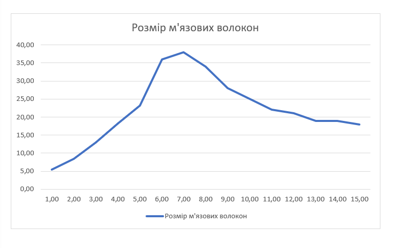
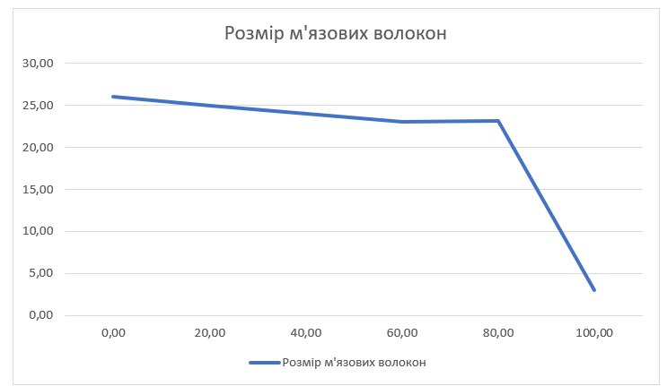
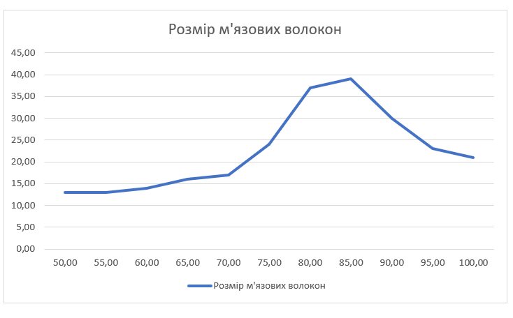

## Комп'ютерні системи імітаційного моделювання
## СПм-22-6, **Лисенко Назар Олександрович**
### Лабораторна робота №**1**. Опис імітаційних моделей та проведення обчислювальних експериментів

 

### Варіант 12, модель у середовищі NetLogo:
[Muscle Development](http://www.netlogoweb.org/launch#http://www.netlogoweb.org/assets/modelslib/Sample%20Models/Biology/Muscle%20Development.nlogo)

 

### Вербальний опис моделі:
Ця модель агентів призначена для симуляції процесів росту та розвитку м'язової тканини в організмі. Основна ідея полягає в імітації взаємодії різних факторів, таких як гормони, фізична активність, сон і т. д., для моделювання реальних процесів, які відбуваються в організмі людини під час фізичної активності та відновлення.

### Керуючі параметри:
- **lift** -  Визначає, чи особа виконує фізичні вправи з важкими вагами.
- **intensity** - Визначає, наскільки напруженою є фізична активність. Вища інтенсивність веде до більшого втомлення м'язових волокон під час кожного тренування.
- **hours-of-sleep** - Визначає тривалість сну для відновлення м'язів. Відпочинок під час сну впливає на відновлення організму та рост м'язової тканини.
- **days-between-workouts** - Визначає інтервал між тренуваннями. Частота тренувань впливає на час, який організм має для відновлення м'язів.
- **%slow-twitch-fibers** - Визначає ймовірність того, що кожне м'язове волокно матиме характеристики повільного скорочення.
  
### Внутрішні параметри:
- **fiber-size** - Вказує на розмір кожного м'язового волокна в системі. Цей параметр відрізняється від вбудованого «розміру» і використовує інші одиниці виміру, визначаючи, ймовірно, обсяг чи масштаб волокна.
- **max-size** - Представляє максимальний розмір, якого може досягти м’язове волокно.
- **anabolic-hormone** - Рівень анаболічних гормонів в системі. Анаболічні гормони сприяють відновленню та наростанню м'язових волокон.
- **catabolic-hormone** - Рівень катаболічних гормонів в системі. Катаболічні гормони сприяють руйнуванню м'язових волокон.
- **anabolic-hormone-max, anabolic-hormone-min, catabolic-hormone-max, catabolic-hormone-min** - Глобальні змінні, які використовуються для встановлення меж для рівнів анаболічних і катаболічних гормонів у моделюванні.
- **muscle-mass** - Зберігає суму розмірів м'язових волокон в системі. Це важлива глобальна величина, яка відображає загальну масу м'язової тканини в організмі.
- **hormone-diffuse-rate** - Визначає, з якою швидкістю гормони розповсюджуються від одного м'язового волокна до іншого в системі. Це важливий фактор взаємодії гормонів між волокнами.
  
### Показники роботи системи:
- Анаболічні гормони: Середній вміст анаболічних гормонів в системі, розрахований як середнє значення вмісту анаболічних гормонів у всіх м'язових волокнах. Відображає, наскільки ефективно анаболічні гормони відновлюють м'язові волокна.
- Катаболічні гормони: Середній вміст катаболічних гормонів в системі, визначений як середнє значення катаболічних гормонів у всіх м'язових волокнах. Відображає, наскільки активно катаболічні гормони руйнують м'язові волокна.
- Маса м'язових волокон: Визначається як сума розмірів усіх м'язових волокон в системі. Маса м'язових волокон зростає або зменшується в залежності від балансу між анаболічними та катаболічними гормонами. Цей показник є ключовим для відслідковування ефективності тренувань та відновлення м'язів.

### Примітки:
- Модель включає фактори, що відображають вплив різних щоденних активностей, таких як тренування, сон та звичайні рухи. Це дозволяє аналізувати вплив загального стилю життя на розвиток м'язів.

### Недоліки моделі:
- Модель є спрощеною абстракцією реальних фізіологічних процесів. Вона не враховує багато деталей та індивідуальних варіацій, що можуть впливати на розвиток м'язів.
- Ріст м'язів моделюється одним параметром - розміром м'язового волокна. У реальності м'язовий розвиток є більш складним, включаючи гіпертрофію, новоутворення волокон, інші адаптації тканини тощо.
- Деякі глобальні параметри, такі як максимальні та мінімальні значення гормонів, залишаються статичними протягом всієї симуляції, що може обмежити реалістичність моделі.
  
 

## Обчислювальні експерименти

### 1. Вплив інтервалу між тренуваннями на рівні гормонів
Досліджується залежність рівнів гормонів протягом певної кількості тактів (500) від інтервалу між тренуваннями.
Експерименти проводяться при 1-15 днів між тренуваннями, з кроком 1, усього 15 симуляцій.  
Інші керуючі параметри мають значення за замовчуванням:
- **hours-of-sleep**: 8
- **intensity**: 95
- **%slow-twitch-fibers**: 50
- **lift**: on

<table>
<thead>
<tr><th>Інтервал між тренуваннями</th><th>Розмір м'язових волокон</th></tr>
</thead>
<tbody>
<tr><td>1</td><td>5.5</td></tr>
<tr><td>2</td><td>8.4</td></tr>
<tr><td>3</td><td>13</td></tr>
<tr><td>4</td><td>18.2</td></tr>
<tr><td>5</td><td>23.2</td></tr>
<tr><td>6</td><td>36</td></tr>
<tr><td>7</td><td>38</td></tr>
<tr><td>8</td><td>34</td></tr>
<tr><td>9</td><td>28</td></tr>
<tr><td>10</td><td>25</td></tr>
<tr><td>11</td><td>22</td></tr>
<tr><td>12</td><td>21</td></tr>
<tr><td>13</td><td>19</td></tr>
<tr><td>14</td><td>19</td></tr>
<tr><td>15</td><td>18</td></tr>
</tbody>
</table>

 З аналізу таблиці видно, що розмір м'язових волокон збільшується зі збільшенням інтервалу між тренуваннями до певного пункту (близько 6-7 днів), після чого відбувається не такий помітний ріст. А при котоктих інтервалах (1-3 дні) розмір м'язових волокон взагалі зменшується.

 

### 2. Вплив відсотка м'язових волокно з характеристиками повільного скорочення на ріст м'язів
Досліджується залежність росту м'язів протягом певної кількості тактів (500) від відсотка м'язових волокно з характеристиками повільного скорочення.
Експерименти проводяться при 0%-100% м'язових волокно з характеристиками повільного скорочення, з кроком 20%, усього 6 симуляцій.  
Інші керуючі параметри мають значення за замовчуванням:
- **intensity**: 95
- **hours-of-sleep**: 8
- **days-between-workouts**:5
- **lift**: on

<table>
<thead>
<tr><th>Відсоток м'язових волокон з повільним скороченням</th><th>Розмір м'язових волокон</th></tr>
</thead>
<tbody>
<tr><td>0</td><td>26</td></tr>
<tr><td>20</td><td>24</td></tr>
<tr><td>40</td><td>24</td></tr>
<tr><td>60</td><td>23</td></tr>
<tr><td>80</td><td>23</td></tr>
<tr><td>100</td><td>3</td></tr>
</tbody>
</table>

За результатами експерименту видно, що при відсутності повільних волокон (0%) розмір м'язів є найбільшим. Однак, при збільшенні відсотка повільних волокон, спостерігається зниження розміру м'язових волокон. Це може свідчити про те, що певний баланс між різними типами волокон є ключовим для оптимального росту м'язів.

 

### 3. Вплив інтенсивності фізичної активності тренування на ріст м'язів.
Досліджується залежність росту м'язів протягом певної кількості тактів (500) від інтенсивності тренування.
Експерименти проводяться при 50-100 інтенсивності, з кроком 5, усього 11 симуляцій.  
Інші керуючі параметри мають значення за замовчуванням:
- **hours-of-sleep**: 8
- **days-between-workouts**: 5
- **%slow-twitch-fibers**: 50
- **lift?**: on

<table>
<thead>
<tr><th>Інтенсивність фізичної активності</th><th>Розмір м'язових волокон</th></tr>
</thead>
<tbody>
<tr><td>50</td><td>13</td></tr>
<tr><td>55</td><td>13</td></tr>
<tr><td>60</td><td>14</td></tr>
<tr><td>65</td><td>16</td></tr>
<tr><td>70</td><td>17</td></tr>
<tr><td>75</td><td>24</td></tr>
<tr><td>80</td><td>37</td></tr>
<tr><td>85</td><td>39</td></tr>
<tr><td>90</td><td>30</td></tr>
<tr><td>95</td><td>23</td></tr>
<tr><td>100</td><td>21</td></tr>
</tbody>
</table>

За результатами експерименту видно, що розмір м'язових волокон збільшується разом із зростанням інтенсивності тренувань до певної точки. Інтенсивність 85 виглядає як точка, де розмір м'язових волокон досягає свого піку. Це може свідчити про те, що тренування з високою інтенсивністю може бути ефективним для стимулювання росту м'язової маси. Однак, тренування на дуже високому рівні інтенсивності (95-100) може бути менш ефективним або навіть негативно впливати на розмір м'язових волокон.

